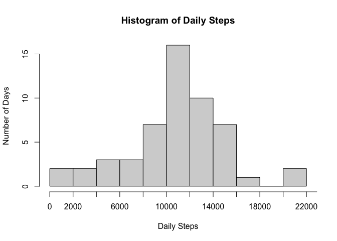
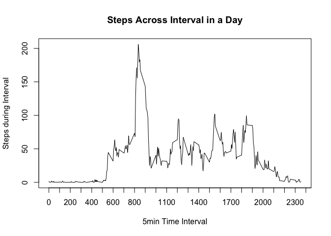
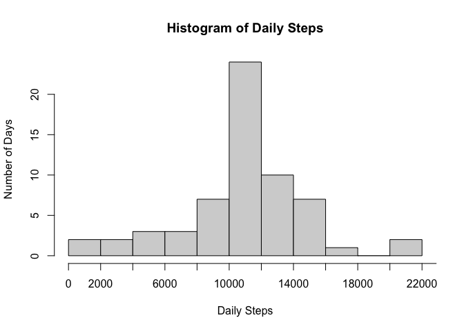
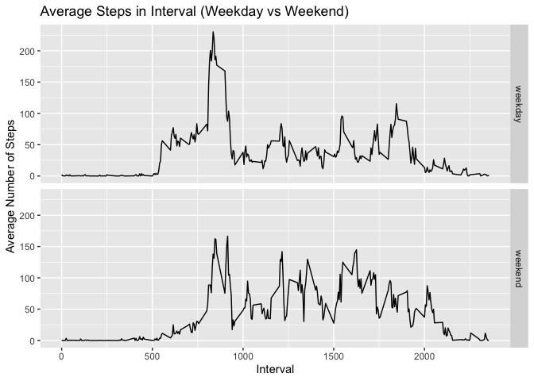

## Loading and preprocessing the data

### Reading CSV File

The data file is within the existing working directory and is named activity.csv.
This is read into a dataframe - ActivityDB. The headers of the three columns are "steps", "date", "interval".
"steps" is the total steps taken on that date in that time interval (of 5 minutes)
"date" is the date the steps were recorded (between October 1 2012 to November 30 2012)
"interval" is the specific 5-minute interval in a 24 hour day.


```r
ActivityDB <- read.csv("activity.csv")
```


## What is mean total number of steps taken per day?

### Histogram for Daily Steps

Steps are accumulated for each day. Any day with missing values all day (NA) are dropped.
A histogram of number of days in each bin of steps is presented. Bins are set to 1,000 steps for granularilty.


```r
DailySteps <- tapply(ActivityDB$steps,ActivityDB$date,sum,na.rm=FALSE)
hist(DailySteps,main="Histogram of Daily Steps",ylab = "Number of Days",xlab = "Daily Steps",breaks = 10,xaxt="n")
axis(side=1, at=seq(0,25000, 2000), labels=seq(0,25000,2000))
```

<!-- -->

```r
average <- round(mean(DailySteps,na.rm=TRUE))
middle <- median(DailySteps,na.rm=TRUE)
```

### Mean and Median of steps

The mean of the daily steps is: 10766  
The median of the daily steps is: 10765


## What is the average daily activity pattern?

### Daily Activity Pattern

Steps are accumulated by interval and averaged across days. Averages are presented 
in a line chart.


```r
IntervalSteps <- tapply(ActivityDB$steps,ActivityDB$interval,mean,na.rm=TRUE)
plot(as.integer(names(IntervalSteps)),IntervalSteps,type = "l", main = "Steps Across Interval in a Day", xlab = "5min Time Interval", ylab = "Steps during Interval",xaxt="n")
axis(side=1, at=seq(0,2500, 100), labels=seq(0,2500,100))
```

<!-- -->

```r
maxSteps <- names(IntervalSteps)[IntervalSteps == max(IntervalSteps)]
```
  
### Time Interval Max Steps
The time interval with the max steps is 835, when the average steps are 206.1698113.  
  
  


## Imputing missing values

### Assessing Missing Values
A number of records have NA values, in some cases whole days.


```r
numofNA <- sum(is.na(ActivityDB$steps))
daysofNA <- (is.na(DailySteps))
```
  
Total number of missing values is 2304 and number of days missing all values is 8.  
  

### Replace missing values with average of that interval
Use the libary 'tidyr' to convert the dataframe into a datatable where the row names are the dates and the column names are the time intervals. Then replace each day with whole NA's with the mean of each interval (from above section 3 - IntervalSteps). Then check if all NA's accounted for.


```r
library(tidyr)
ActivityDT <- spread(ActivityDB,interval,steps)
rownames(ActivityDT) <- ActivityDT$date
ActivityDT <- ActivityDT[,-1]

for (i in which(daysofNA)) {ActivityDT[i,] <- IntervalSteps}
NAs_left <- sum(is.na(ActivityDT))
```

Number of NA's left in database = 0.  


### Reprint histogram of new dataset
Reframe the new table as a dataframe (in original structure) and reprint histogram and mean and median. 


```r
ActivityDT <- cbind(rownames(ActivityDT),ActivityDT)
colnames(ActivityDT) <- c("date",colnames(ActivityDT[,-1]))
ActivityDBnew <- pivot_longer(ActivityDT,cols = !1,names_to = "interval",values_to = "steps")

DailyStepsNew <- tapply(ActivityDBnew$steps,ActivityDBnew$date,sum,na.rm=FALSE)
hist(DailyStepsNew,main="Histogram of Daily Steps",ylab = "Number of Days",xlab = "Daily Steps",breaks = 10,xaxt="n")
axis(side=1, at=seq(0,25000, 2000), labels=seq(0,25000,2000))
```

<!-- -->

```r
averageNew <- round(mean(DailyStepsNew,na.rm=TRUE))
middleNew <- median(DailyStepsNew,na.rm=TRUE)
```
  
  
### Assess new mean and median
The mean of the daily steps is: 10766  
The median of the daily steps is: 10766.1886792453  

Since the mean of each time interval was used the replace the missing NA days, the overall shape of the histogram hasn't changed, though the total number of days has gone up (no more NA days). And so the mean and median remain unchanged.


## Are there differences in activity patterns between weekdays and weekends?

Comparing the average number of each time interval, split between weekdays and weekends, determine if there is a difference in the pattern.

First add a column to the database noting if that row is of a weekday of weekend. The 'dplyr' package provides the tools to groupby the dayType (weekday or weekend) to calculate the mean. Then use ggplot to plot the two panels summarizing the data.


```r
dayType <- ifelse ((weekdays(as.Date(ActivityDBnew$date)) == "Sunday" | weekdays(as.Date(ActivityDBnew$date)) == "Saturday"),"weekend", "weekday")
ActivityDBnew <- cbind(ActivityDBnew,dayType)

library(dplyr)
```

```
## 
## Attaching package: 'dplyr'
```

```
## The following objects are masked from 'package:stats':
## 
##     filter, lag
```

```
## The following objects are masked from 'package:base':
## 
##     intersect, setdiff, setequal, union
```

```r
library(ggplot2)
grouped <- group_by(ActivityDBnew,dayType,interval)
SummOut <- summarize(grouped,avgSteps = mean(steps,na.rm=TRUE))
```

```
## `summarise()` regrouping output by 'dayType' (override with `.groups` argument)
```

```r
SummOut$interval <- as.integer(SummOut$interval)
SummOut <- SummOut[order(SummOut$interval),]
qplot(interval,avgSteps,data = SummOut,facets = dayType ~.,main = "Average Steps in Interval (Weekday vs Weekend)", ylab = "Average Number of Steps",xlab = "Interval",geom = c("line"))
```

<!-- -->
  
Steps during the weekdays reach a higher max with greater variability (between intervals) than those on the weekend.
